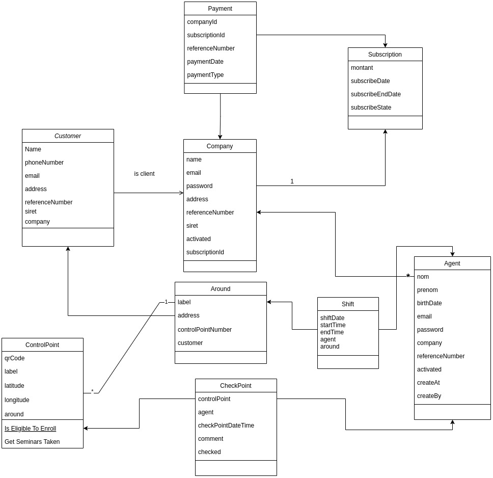

# Monitoring
Monitoring is a small API for handling security agent to help them to do their job, by making some around by scanning some checkpoint 

# Getting Started
  ---------------
1. ``` git clone https://github.com/azy64/monitoring.git```

2. ``` cd monitoring ```

3. ``` docker-compose up ```

4. ```docker exec -ti monitoring_server-db_1 bash /home/create-user.sh ```


Checking
-------
5. 
    - ``` docker exec -ti monitoring_server-db_1 bash ```

    - ``` mysql -u root -D mysql -p ```

    - ``` select user from mysql.user; ```

6. ``` docker exec -ti monitoring_server-web_1 bash /home/monitoring/apt-install.sh ```

7. Go to your host browser and type: http://localhost:8000/monitoring/homepage, it should display: "Je suis la page homepage" 

